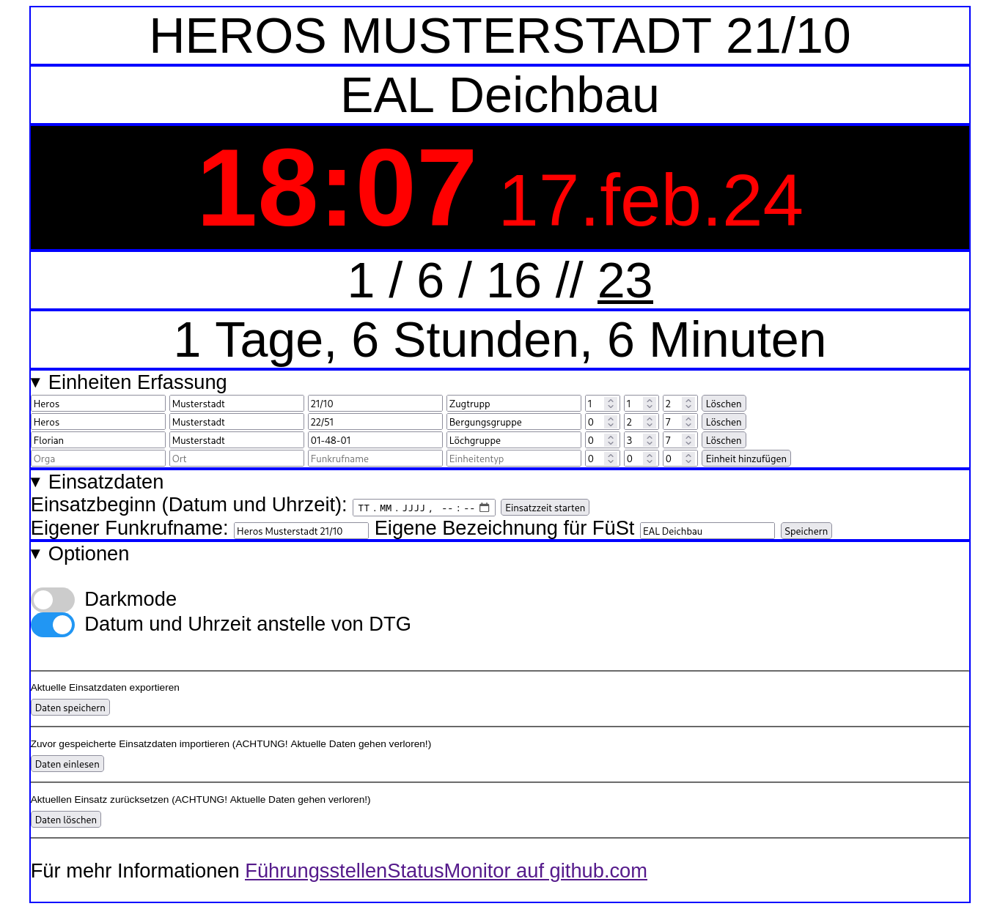

# Führungsstellen Status Monitor
ein fork von [ goerdy/FuehrungsstellenStatusMonitor](https://github.com/goerdy/FuehrungsstellenStatusMonitor)
## Beschreibung
Eine simple php und JS Seite, die lokal mit Server im Browser läuft um einen Statusmonitor für Führungsfahrzeuge im Katastrophenschutz etc. anzeigen zu können. 
Ideal für Führungsstellen und Zugtrupps. 
Mit taktischer Zeit (Datum-Zeit-Gruppe), Einsatzdauer, Stärkemeldung... 
Mit hellem und dunklem Anzeigemodus. 

## How to
### Lokal:
Einfach die PC/Server mit docker laden und `docker compose up -d` danach sollte die seite mit http://ip-adresse:8000/einsatzmonitor.php erreichbar sein und mit http://ip-adresse:8000/einsatzmonitor.php?options Steuerbar sein.
### Hosted
Unter https://einsatzmonitor.d0nk.xyz/einsatzmonitor.php gibts eine gehostete Variante, ich empfehle aber die PHP Datei runter zu laden und auf einem Raspi zu Hosten.
Um die Einstellungen zu ändern einfach https://einsatzmonitor.d0nk.xyz/einsatzmonitor.php?options aufrufen. 

## Datenschutz und so
Alle daten werden auf dem Server verarbeitet und gespeichert.
Es werden keine externen Skripte oder sonstige Sachen geladen.

## Feature Requests / Bug reporting...
Wenn du gerne irgendetwas anders hättest... mach eine Issue auf und ich versuche das umzusetzen, wenn die Zeit dafür da ist.

## Disclaimer
Status: "Works for me"
ziemlich miese Codequalität und diverse Fehler und Probleme... mit viel Zeit und Langeweile wird das vielleicht noch Mal besser.